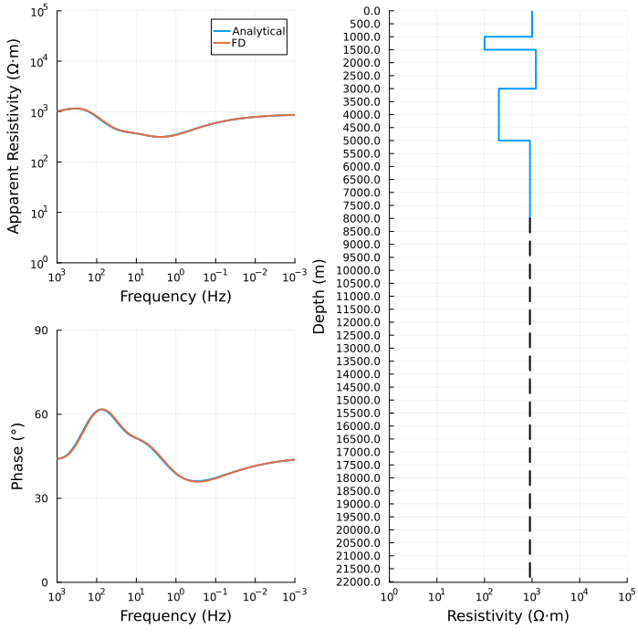
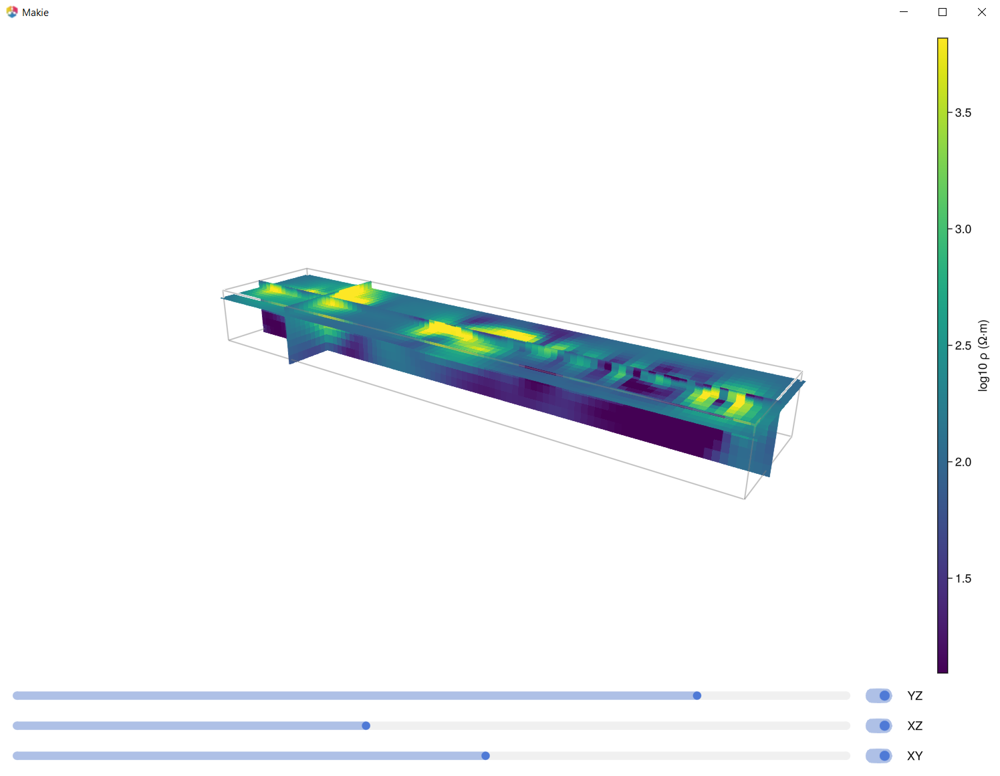

# MTGeophysics
Julia codes for magnetotelluric geophysics research and applications 

This repository is under development, don't use it yet! But if you're don't like warnings here is what should work 

- create a new directory 
- start Julia 
- using Pkg; Pkg.activate (.); Pkg.instantiate 
-  add MTGeophysics 
- include("examples/01_mt1d_forward.jl")
The last line will run 1D forward modeling example. 

If you want to plot ModEM model and interactively visualise it, you need GLMakie 
check out the src/viz directory which has running instruction in the source code. I will creating a running version in the example directory soon. 

# What's here now 
- MT 1D forward modeling with analytical and FD methods 
- Model file and mesh in UBC format 

 
 

