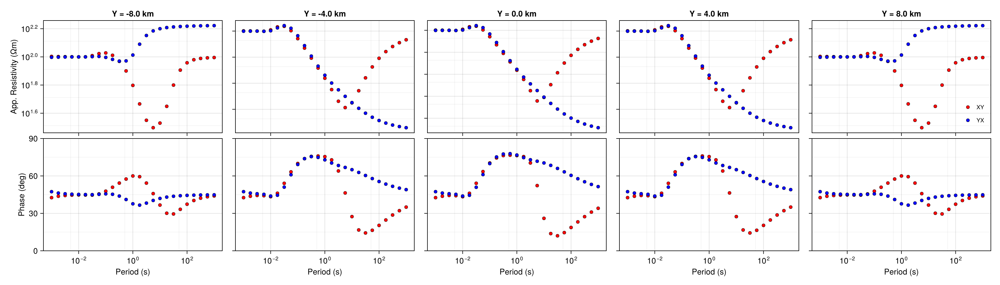
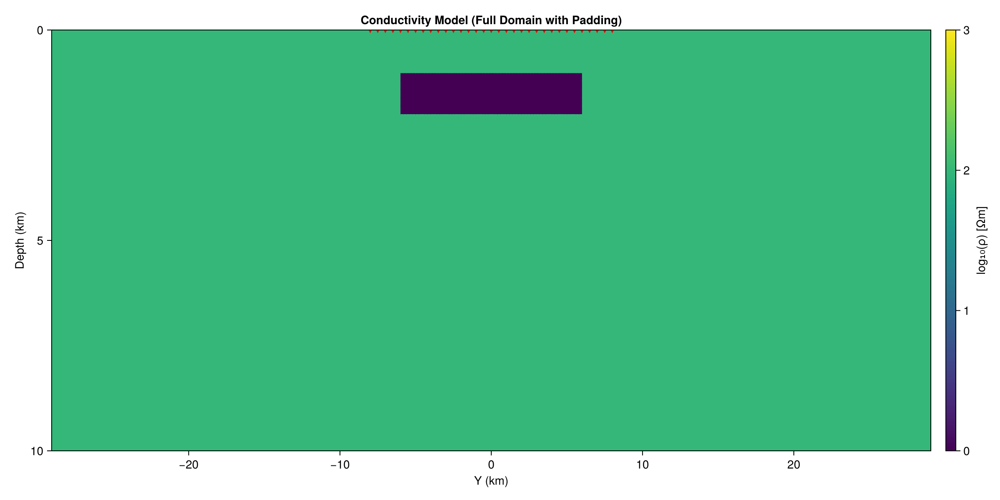

<h1 align="center">MTGeophysics.jl</h1>

<p align="center">
	<b>Julia codes for magnetotelluric geophysics research and applications</b>
</p>

<p align="center">
	<em>3D stochastic inversion functionality for MT is coming soon!</em>
</p>

---


## Quick Start

```julia
# In a new directory:
using Pkg; Pkg.activate("."); Pkg.instantiate()
Pkg.add("MTGeophysics")
include("examples/01_mt1d_forward.jl") # 1D forward modeling example
```

---


## Visualization

- For interactive ModEM model visualization, install <b>GLMakie</b>.
- See <code>src/viz</code> for code and instructions.
- A runnable example will be added to <code>examples/</code> soon.

---


## Gallery


<div align="center">
  
  
  
  
</div>

