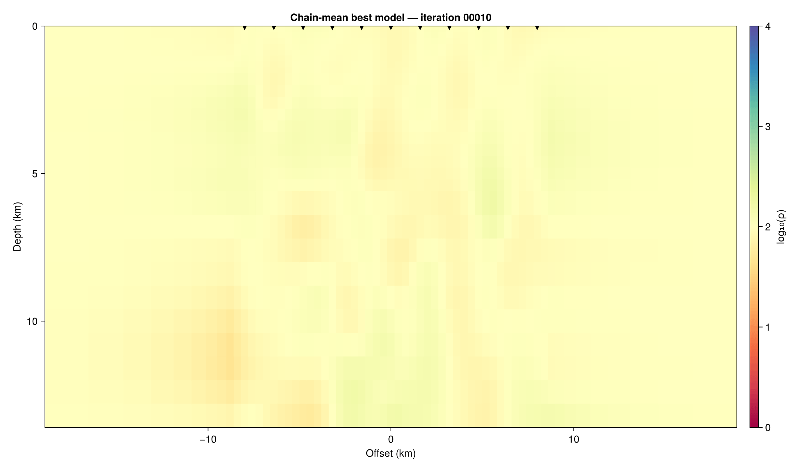
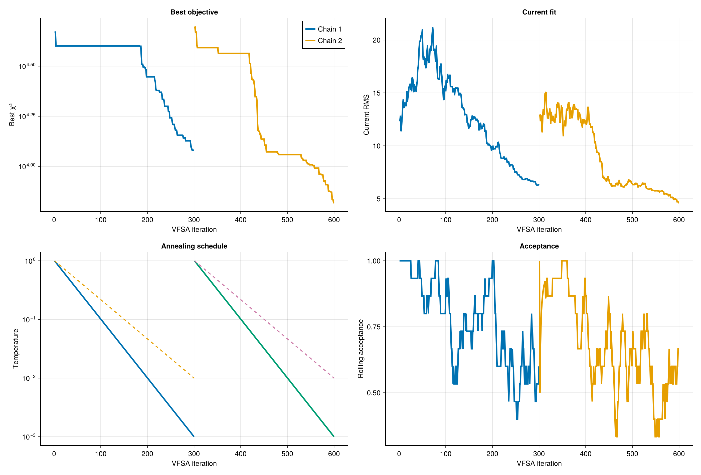

<h1 align="center">MTGeophysics.jl</h1>

<p align="center"><em>Magnetotelluric modelling, inversion, and visualization workflows in Julia.</em></p>

<p align="center">
	<a href="https://juliageophysics.github.io/MTGeophysics.jl/">
		
	</a>
	<a href="https://github.com/JuliaGeophysics/MTGeophysics.jl/actions/workflows/Documenter.yml">
		
	</a>
	<a href="https://github.com/JuliaGeophysics/MTGeophysics.jl/releases">
		
	</a>
</p>

<p align="center">
	<a href="https://github.com/JuliaGeophysics/MTGeophysics.jl/blob/main/LICENSE.md">
		
	</a>
	<a href="https://github.com/JuliaGeophysics/MTGeophysics.jl/stargazers">
		
	</a>
	<a href="https://github.com/JuliaGeophysics/MTGeophysics.jl/issues">
		
	</a>
	<a href="https://github.com/JuliaGeophysics/MTGeophysics.jl/pulls">
		
	</a>
</p>

---


## Features

- 1D and 2D MT forward solvers (analytical and finite-difference)
- 2D/3D VFSA inversion with ensemble uncertainty quantification
- ModEM 3D model and data I/O
- Interactive 3D slice viewers (GLMakie) with GIS overlays and coordinate reprojection
- Shapefile export for GIS integration

## Installation

```
julia --project=. -e 'using Pkg; Pkg.instantiate()'
```

## Quick example: 2D VFSA inversion

> Note: This is a quick demonstration workflow. For production-quality inversion, tune key settings such as the number of VFSA iterations, number of chains, cooling schedule, regularization choices, and uncertainty/ensemble controls for your survey and model size.

1. Build a synthetic 2D benchmark model and generate inputs.

```
julia --project=. Helpers/benchmarks_2d.jl
```

2. Run the VFSA inversion workflow for the benchmark.

```
julia --project=. examples/run_vfsa2dmt.jl
```

3. Compute ensemble statistics for posterior models and misfit summaries.

```
julia --project=. Helpers/run_statistics_2d.jl
```

4. Create a GIF to visualize inversion evolution through iterations.

```
julia --project=. Helpers/make_gif_2d.jl
```

### 2D VFSA results






## License

[MIT](LICENSE.md)

