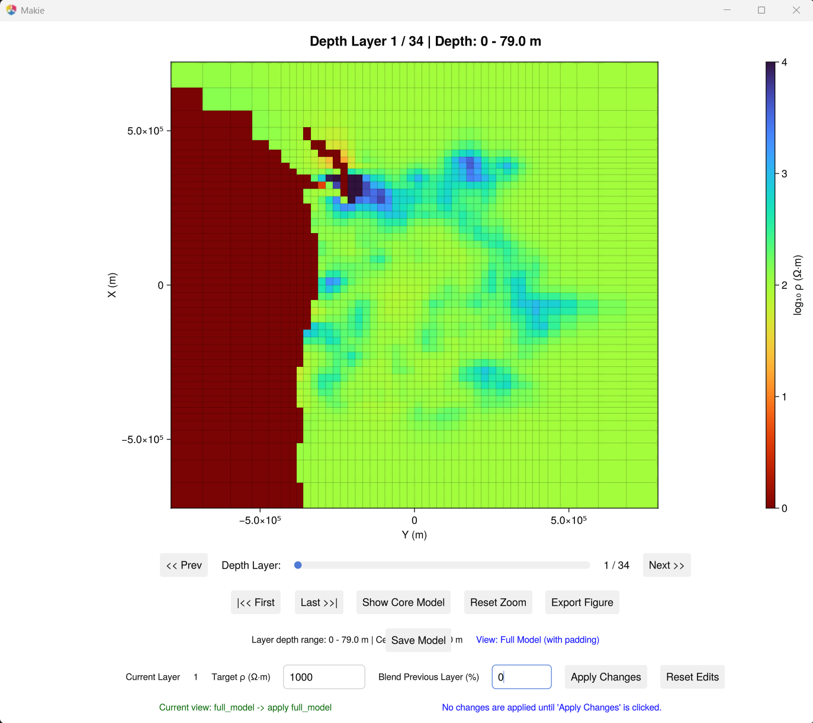
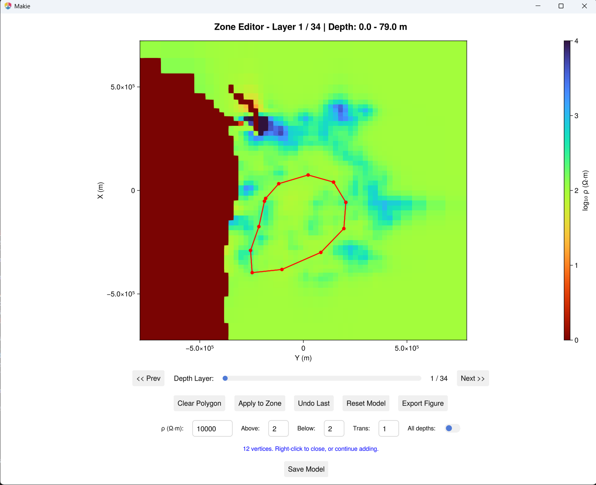

# Model Editing

Interactive tools for modifying 3D resistivity models with visual feedback.

!!! note
    Requires GLMakie and a working OpenGL environment.

## Replace slice resistivity

Replace resistivity below a chosen depth layer, with control over whether the
edit applies to the core model only or to the full model including lateral
padding.

```bash
julia --project=. examples/replace_slice_resistivity_scope.jl
```



### Workflow

1. The script loads a ModEM model and opens an interactive depth-slice viewer.
2. Use the **depth slider** to navigate to the layer you want as the cutoff.
3. Enter a **target resistivity** (Ω·m) and an optional **blend percentage**
   for the layer above the cutoff.
4. Toggle between **core-only** and **full-model** scope with the
   *Show Core Model / Show Full Model* button.
5. Click **Apply Changes** to modify the model in memory.
6. Click **Save Model** to write the edited model to disk.

### Configuration

Edit the variables at the top of the script:

```julia
model_file = joinpath(@__DIR__, "Cascadia", "cascad_half_inverse.ws")

target_resistivity      = 1000.0     # replacement value (Ω·m)
blend_previous_percent  = 0          # 0-100, blend the layer above cutoff
replace_scope           = :core_only # or :full_model

log10_scale       = true
colormap          = Reverse(:turbo)
with_padding      = true
max_depth         = nothing          # nothing = show all layers
resistivity_range = (0.0, 4.0)       # log₁₀ scale colour limits
```

### Output

Saved models include metadata in the header:

```text
<model_name>_modified_layer<N>_rho<R>_blendprev<B>_coreonly.rho
```

## Draw and replace zones

Draw polygon zones on depth slices and replace resistivity within selected
depth intervals. Supports undo, transition layers, and optional all-depths mode.

```bash
julia --project=. examples/draw_and_replace_in_model.jl
```



### Workflow

1. The script loads a ModEM model and opens a zone editor.
2. **Left-click** to add polygon vertices on the depth slice.
3. **Right-click** to close the polygon.
4. Set the **target resistivity**, layers above/below, and transition layers.
5. Toggle **All depths** to apply the replacement across all layers.
6. Click **Apply to Zone** to modify the model in memory.
7. Use **Undo** to revert, or **Reset Model** to restore the original.
8. Click **Save Model** to write the edited model to disk.

### Configuration

Edit the variables at the top of the script:

```julia
model_file = joinpath(@__DIR__, "Cascadia", "cascad_half_inverse.ws")

replacement_resistivity = 10000.0
layers_above            = 2
layers_below            = 2
transition_layers       = 1
apply_to_all_depths     = false
```


