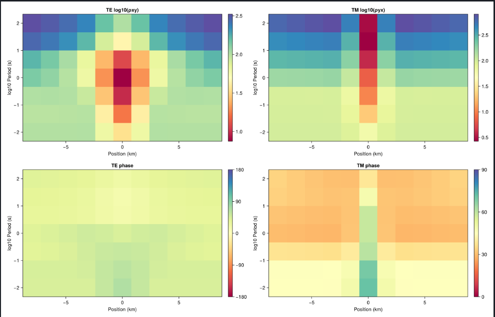

# 2D Forward Modelling

Compute the 2D magnetotelluric forward response (TE and TM modes) on a tensor mesh.



## Running the example

```bash
julia --project=. Examples/response_2d.jl
```

This reads the default COMEMI benchmark model and data, computes the predicted response, and writes data maps and site curve plots.

Custom input files:

```bash
julia --project=. Examples/response_2d.jl path/to/model path/to/dataspec
```

## From Julia

```julia
using MTGeophysics

# File-based: solve and write predicted data
pred_path = ForwardSolve2D("Examples/0COMEMI2D-I/Comemi2D1.true",
                           "Examples/0COMEMI2D-I/Comemi2D1.ref")

# Plot data maps (TE/TM apparent resistivity and phase at each frequency)
PlotData2D(pred_path;
           maps_output_path   = "DataMaps2D.png",
           curves_output_path = "DataCurves2D.png")

# Plot the model
PlotModel2D("Examples/0COMEMI2D-I/Comemi2D1.true";
            output_path = "ModelPlot2D.png")
```

## Building models programmatically

```julia
using MTGeophysics

# Build the default COMEMI mesh
mesh = build_default_mt2d_mesh()

# Create a half-space model
resistivity = build_mt2d_halfspace_model(mesh; background_resistivity=100.0)

# Run TE+TM forward solver
response = run_mt2d_forward(mesh, resistivity)

# Plot
plot_mt2d_model(mesh, resistivity; output_path = "model.png")
plot_mt2d_data_maps(response; maps_output_path = "data_maps.png")
plot_mt2d_site_curves(response; curves_output_path = "site_curves.png")
```

## COMEMI benchmarks

Three standard COMEMI 2D benchmark models are included:

| Case | Description |
|:-----|:------------|
| I | Thin vertical conductive dyke in a two-layer background |
| II | Two resistive blocks in a two-layer background |
| III | Mixed conductors and resistors in a three-layer background |

Generate all three with:

```bash
julia --project=. Helpers/benchmarks_2d.jl
```
