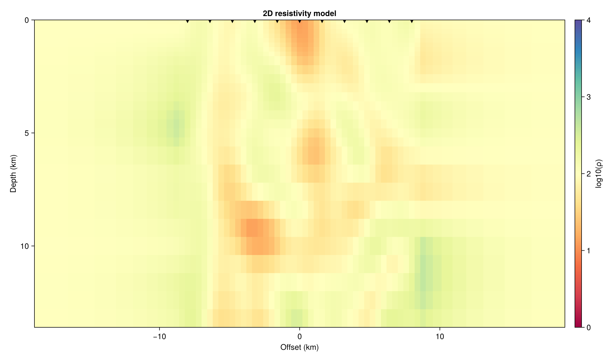
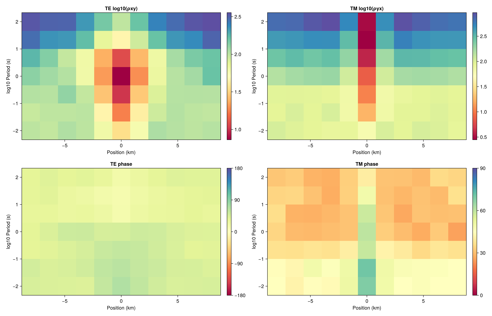

# 2D VFSA Inversion

Run a 2D magnetotelluric inversion using Very Fast Simulated Annealing (VFSA) with multi-chain ensemble sampling and RBF control parameterization.







## Running the example

```bash
julia --project=. Examples/run_vfsa2dmt.jl
```

This runs a two-chain VFSA inversion on the COMEMI-I benchmark and writes results into a timestamped directory under `Examples/`.

## From Julia

```julia
using MTGeophysics

result = VFSA2DMT(
    VFSA2DMTParams(
        script_path      = @__FILE__,
        start_model_path = "Examples/0COMEMI2D-I/Comemi2D1.ini",
        data_path        = "Examples/0COMEMI2D-I/Comemi2D1.obs",
        config = VFSA2DMTConfig(
            n_chains   = 2,
            n_ctrl     = 400,
            max_iter   = 3000,
            n_trials   = 4,
            log_bounds = (0.0, 4.0),
            seed       = 20260308,
            keep_models = true,
        ),
    ),
)
```

## CLI entry point

```bash
julia --project=. -e 'using MTGeophysics; MTGeophysics.main_vfsa2dmt()' -- \
    Examples/0COMEMI2D-I/Comemi2D1.ini \
    Examples/0COMEMI2D-I/Comemi2D1.obs \
    --n-chains 3 --n-ctrl 400 --max-iter 300 --log-bounds 0,4 --seed 20260308
```

## Configuration

| Parameter | Default | Description |
|:----------|:--------|:------------|
| `n_chains` | 2 | Independent Markov chains |
| `n_ctrl` | 400 | RBF control points |
| `max_iter` | 3000 | Iterations per chain |
| `n_trials` | 4 | Trial perturbations per iteration |
| `log_bounds` | (0, 5) | log₁₀(Ω·m) search bounds |
| `keep_models` | false | Save model snapshots for GIF |

## Output

The result directory contains:

```text
run_VFSA2DMT_<timestamp>/
├── run_summary.txt
├── chain_N/
│   ├── log.csv
│   ├── best_model.rho
│   └── snapshots/
├── ensemble_mean.rho
├── ensemble_median.rho
├── ensemble_std.rho
└── plots/
```

## Ensemble analysis

```julia
summary = AnalyseEnsemble2D(result.chain_results;
    true_model_path = "Examples/0COMEMI2D-I/Comemi2D1.true",
)
```

## Post-processing

Recompute ensemble statistics:

```bash
julia --project=. Helpers/run_statistics_2d.jl Examples/run_VFSA2DMT_<timestamp>
```

Generate a convergence GIF (requires `keep_models = true`):

```bash
julia --project=. Helpers/make_gif_2d.jl Examples/run_VFSA2DMT_<timestamp>
```
