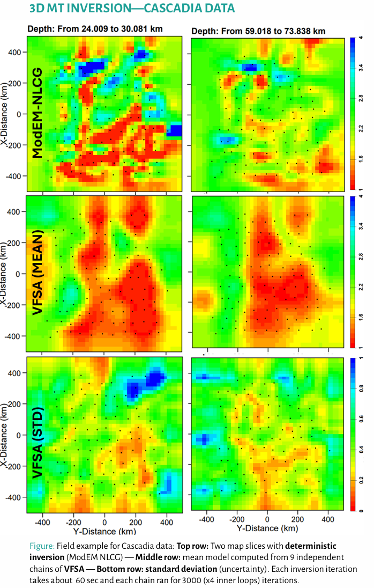

# 3D VFSA Inversion

Run a 3D magnetotelluric inversion using Very Fast Simulated Annealing (VFSA)
with Gaussian-RBF parameterization, multi-chain ensemble sampling, and the
external [ModEM](https://github.com/dong-hao/ModEM-GPU) forward solver.



!!! note "External dependency"
    The 3D VFSA inversion requires **ModEM** (Mod3DMT / Mod3DMT\_2025) compiled
    with MPI support and accessible on your `PATH`, along with an MPI runtime
    (OpenMPI, MPICH, or MS-MPI).

## Running the example

```bash
julia --project=. examples/run_vfsa3dmt.jl
```

The script checks for the ModEM executable before starting. If it is not found
it prints setup instructions and exits.

## From Julia

```julia
using MTGeophysics

cfg = VFSA3DMTConfig(
    nchains   = 2,
    nprocs    = 21,
    n_ctrl    = 900,
    log_bounds = (0.0, 5.0),
    max_iter  = 3000,
    n_trials  = 4,
    seed      = 1911,
    keep_models = true,
)

best_model, iter_log = VFSA3DMT(
    "examples/Cascadia/cascad_half_prior.ws";
    dobs_path = "examples/Cascadia/cascad_errfl5.dat",
    cfg = cfg,
)
```

## Configuration

| Parameter | Default | Description |
|:----------|:--------|:------------|
| `nchains` | 1 | Independent Markov chains |
| `nprocs` | 21 | MPI processes for ModEM forward calls |
| `mpirun_cmd` | `"mpirun"` | MPI launcher command |
| `modem_exe` | `"Mod3DMT_2025"` | ModEM executable name |
| `n_ctrl` | 900 | Gaussian-RBF control points in the core |
| `log_bounds` | (0, 5) | log₁₀(Ω·m) search bounds |
| `step_scale` | 0.05 | VFSA proposal step size |
| `max_iter` | 3000 | Iterations per chain |
| `n_trials` | 4 | Trial perturbations per iteration |
| `T0_prop` | 1.0 | Initial proposal temperature |
| `Tf_prop` | 1e-3 | Final proposal temperature |
| `T0_acc` | 1.0 | Initial acceptance temperature |
| `Tf_acc` | 1e-3 | Final acceptance temperature |
| `seed` | 1911 | Random seed for reproducibility |
| `pad_tol` | 0.2 | Tolerance for core/padding detection |
| `padding_decay_length` | 10.0 | Horizontal padding blend (cell widths) |
| `keep_models` | true | Keep all trial model files |
| `keep_dpred` | false | Keep predicted data files |
| `sigma_scale` | 2.0 | RBF width scaling factor |
| `trunc_sigmas` | 3.0 | RBF truncation distance (in σ) |

## WS3D model format

The 3D VFSA engine uses the **WS3D model format** (Siripunvaraporn et al.),
which stores resistivity in log₁₀(Ω·m). Conversion between WS3D and ModEM
linear formats is handled automatically.

```julia
# Read / write WS3D models directly
m = load_ws3d_model("model.rho")
write_ws3d_model("output.rho", m.dx, m.dy, m.dz, m.A, m.origin)
```

## Ensemble analysis

When multiple chains are run, compute ensemble statistics over the collected
best models:

```julia
mean_path, median_path, std_path = AnalyseEnsemble3D("runs/20260406_120000")
```

This writes `model.mean`, `model.median`, and `model.std` in WS3D format.

The lower-level helper `core_statistics(cores)` computes element-wise mean,
median, and standard deviation over an array of 3D resistivity cubes.

## Output

The result directory contains:

```text
runs/<timestamp>/
├── 0vfsa3DMT.log              # per-iteration summary
├── 0vfsa3DMT_detailed.log     # per-trial detail
├── best_model_chain01.rho     # best model per chain
├── chain01_iter0001.rho       # trial models (if keep_models=true)
├── ...
├── model.mean                 # ensemble mean (if nchains > 1)
├── model.median               # ensemble median
└── model.std                  # ensemble std
```

## Example data

The Cascadia 3D example is not bundled. Download it from
[ModEM-Examples](https://github.com/magnetotellurics/ModEM-Examples/tree/main/Magnetotelluric/3D_MT/Cascadia)
and place it in `examples/Cascadia/`.
