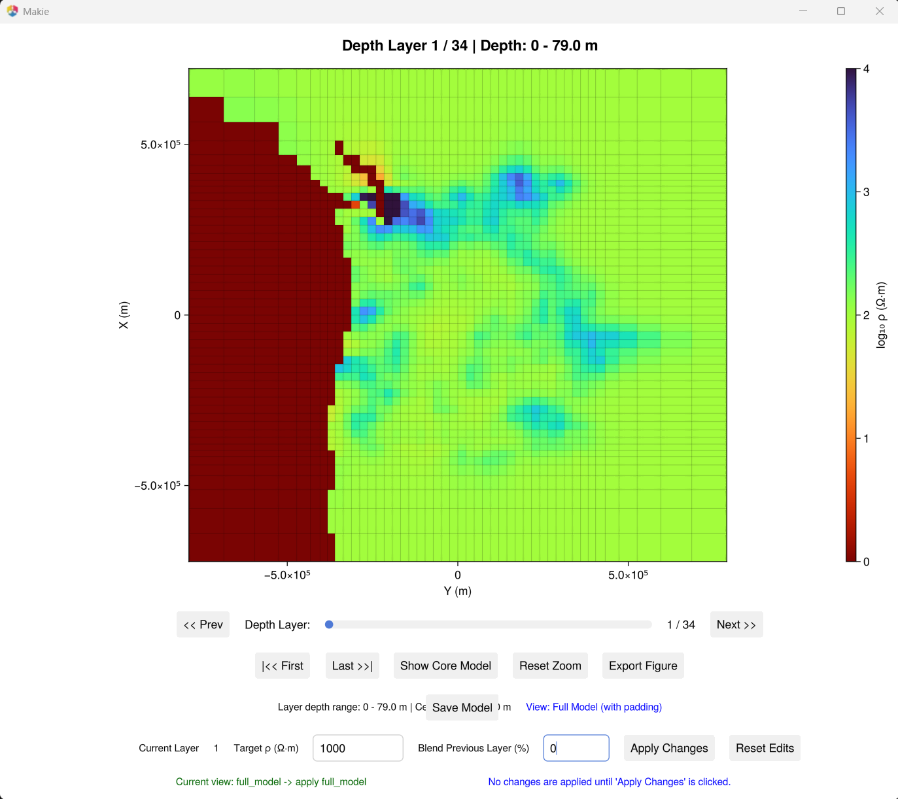
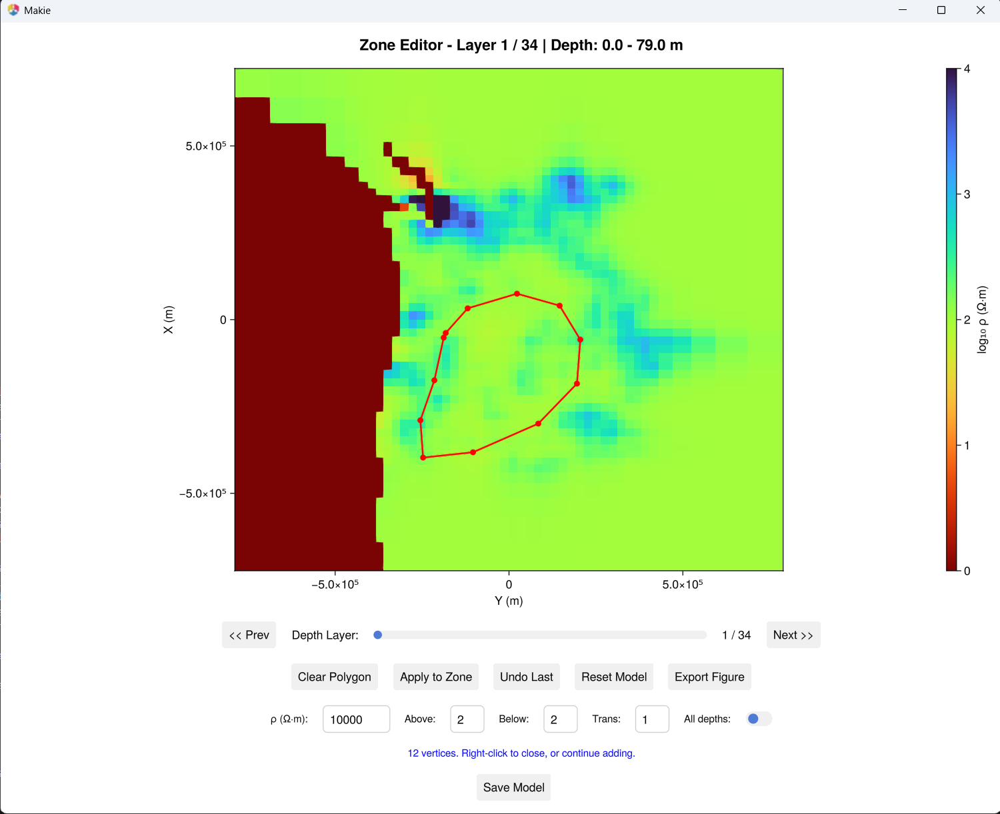

# 3D model editing

Sometimes you want to change a model by hand: replace the deep part with a uniform resistivity, or
insert a body to test whether the data need it. The two editors in this section do this
interactively, on depth slices, and save the edited model as a new file.

!!! note
    The editors open interactive windows, so they need GLMakie and a working OpenGL display.

The examples use the Cascadia model; see [Example data](3d_models.md) for how to get it.

```julia
using MTGeophysics

model_file = "examples/cascadia/cascad_half_inverse.ws"
```

## Replace everything below a depth

```julia
EditModelByLayers(model_file; target_resistivity = 1000.0)
```



1. Move the **depth slider** to the layer where the change should start.
2. Enter the **target resistivity** (Ω·m). A **blend percentage** smooths the layer above.
3. Choose whether to edit the core only or the full model, padding included, with
   **Show Core Model / Show Full Model**.
4. Click **Apply Changes**, then **Save Model**.

The saved file name records what was done, for example
`<model>_modified_layer<N>_rho<R>_blendprev<B>_coreonly.rho`.

## Draw a zone and replace it

```julia
EditModelByDrawing(model_file; replacement_resistivity = 10000.0)
```



1. **Left-click** on the depth slice to add the corners of a polygon, and **right-click** to close it.
2. Set the **target resistivity** and how many layers above and below the slice to change.
   **Transition layers** blend the edge of the zone into the model, and **All depths** applies the
   change to the whole column.
3. Click **Apply to Zone**. **Undo** reverts the last change, **Reset Model** all of them.
4. Click **Save Model**.

## From the command line

```bash
julia --project=. examples/manipulate_model_by_layers.jl <model.ws>
julia --project=. examples/manipulate_model_by_drawing.jl <model.ws>
```

The settings are keyword arguments of the two functions, and variables at the top of the scripts.
