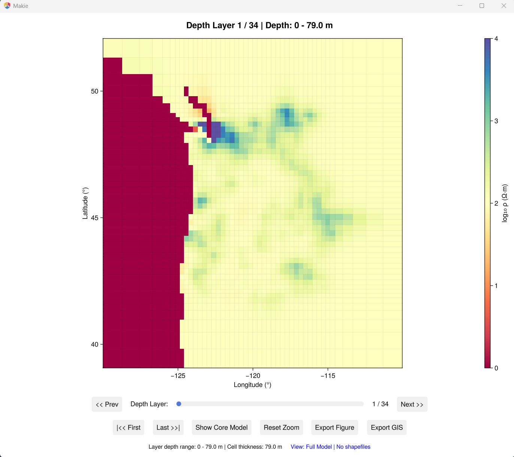
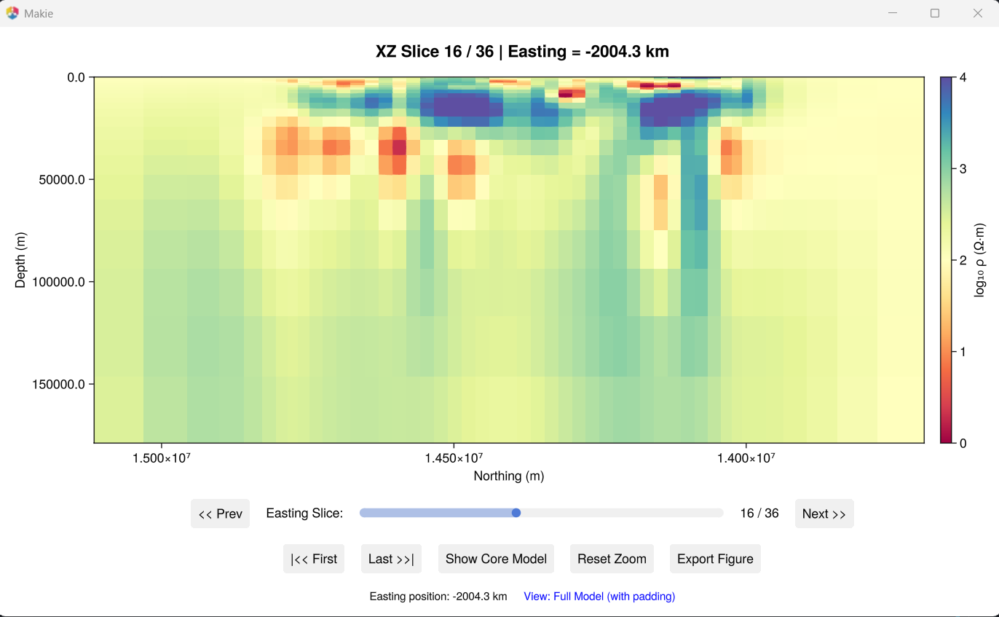
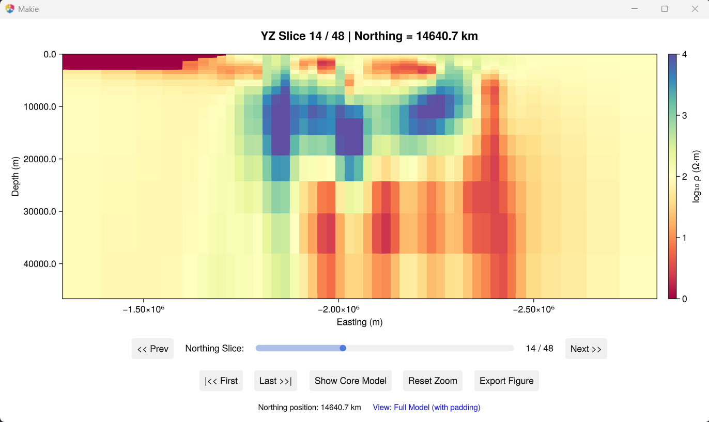

# 3D Visualization

Interactive GLMakie viewers for exploring 3D resistivity models with depth slices, cross-sections, and GIS overlays.

!!! note
    Requires GLMakie and a working OpenGL environment.

## Full 3D slice viewer

```bash
julia --project=. Examples/plot_model_3D.jl
```

Combined XY/XZ/YZ slices with depth controls, padding toggle, shapefile overlays, and figure export.


## XY depth slices

```bash
julia --project=. Examples/plot_XY_slices.jl
```

Horizontal map-view slices at selectable depths.



## XZ cross-sections

```bash
julia --project=. Examples/plot_XZ_slices.jl
```

North-South vertical sections at selectable East-West positions.



## YZ cross-sections

```bash
julia --project=. Examples/plot_YZ_slices.jl
```

East-West vertical sections at selectable North-South positions.



## Coordinate systems

Switch the coordinate mode at the top of each viewer script:

| Mode | Description |
|:-----|:------------|
| `"model"` | Local model coordinates (metres) |
| `"EPSG:3067"` | Finnish national grid |
| `"EPSG:4326"` | WGS84 latitude/longitude |

## GIS overlays

Add shapefile overlays by setting `shapefile_path` in the viewer script:

```julia
shapefile_path = "path/to/coastline.shp"
target_crs     = "EPSG:3067"
```

## Model editing (experimental)

Interactive scripts for modifying resistivity values by hand:

```bash
julia --project=. Examples/edit_model_by_slice.jl
julia --project=. Examples/edit_model_by_drawing.jl
```

## Example data

The Cascadia 3D example is not bundled. Download it from [ModEM-Examples](https://github.com/magnetotellurics/ModEM-Examples/tree/main/Magnetotelluric/3D_MT/Cascadia) and place it in `Examples/Cascadia/`.
