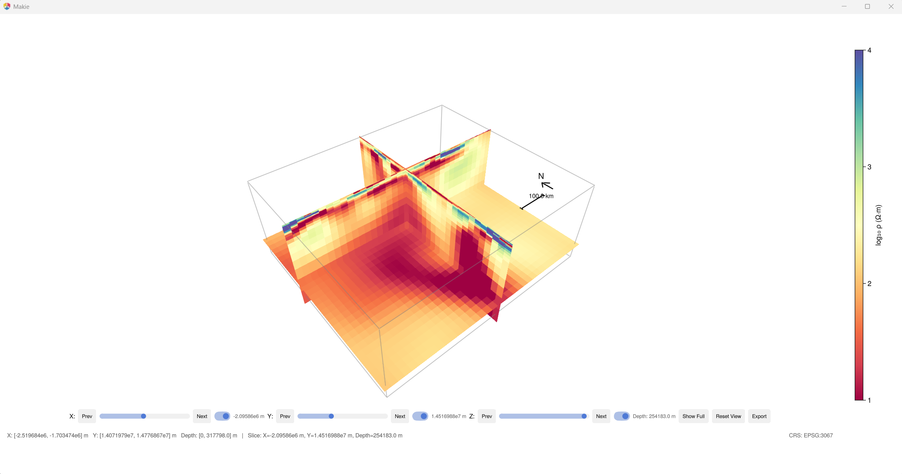
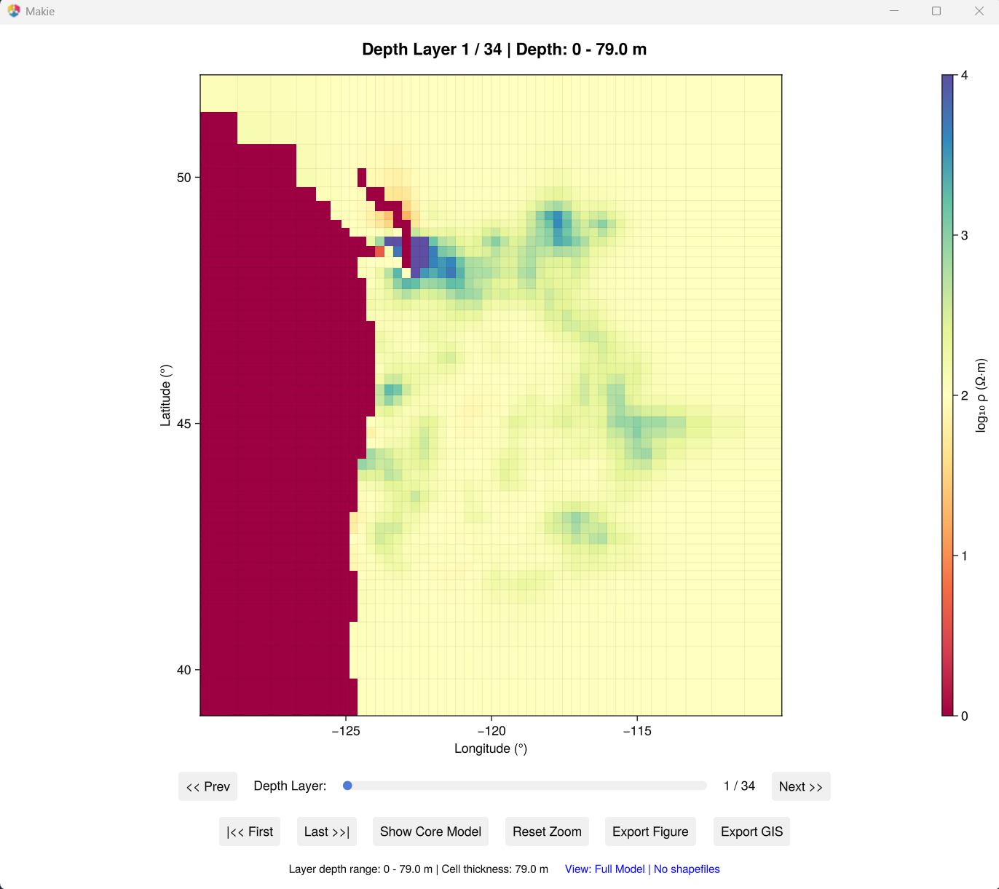
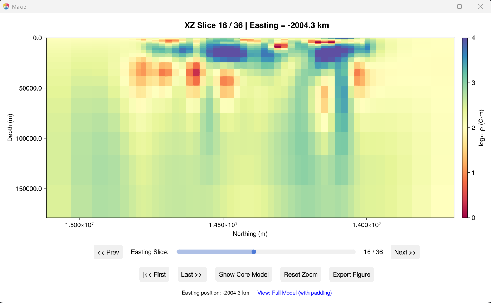
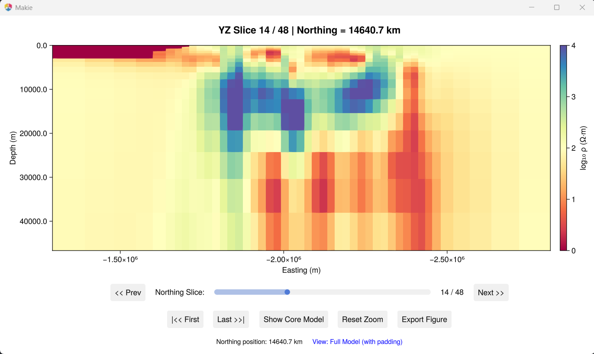

# 3D Visualization

Interactive GLMakie viewers for exploring 3D resistivity models with depth slices, cross-sections, and GIS overlays.

!!! note
    Requires GLMakie and a working OpenGL environment.

## Full 3D slice viewer

```bash
julia --project=. examples/plot_model_XYZ.jl examples/cascadia/cascad_half_inverse.ws examples/cascadia/cascad_errfl5.dat
```

Combined XY/XZ/YZ slices with depth controls, padding toggle, shapefile overlays, and figure export.



## XY depth slices

```bash
julia --project=. examples/plot_model_XY_slices.jl examples/cascadia/cascad_half_inverse.ws examples/cascadia/cascad_errfl5.dat EPSG:32610
```

Horizontal map-view slices at selectable depths.



## XY depth slices with shapefile overlays

```bash
julia --project=. examples/plot_model_XY_with_shapefiles.jl examples/cascadia/cascad_half_inverse.ws examples/cascadia/cascad_errfl5.dat EPSG:32610
```

Same viewer with any number of shapefiles overlaid on the map view; configure
the `shapefiles` list at the top of the script. Each shapefile is reprojected
from its native CRS (`.prj` sidecar) into the chosen coordinate system.

## XY map view with shapefiles (any projected CRS)

```bash
julia --project=. examples/plot_model_XY_with_shapefiles.jl
```

Map view with shapefile overlays that works in WGS 84 lat/lon or **any**
projected EPSG CRS — e.g. `EPSG:3067` (Finland), `EPSG:32610` / `EPSG:26910`
(Cascadia UTM 10N), `EPSG:3005` (BC Albers). GIS exports carry a `.prj`
generated for the chosen CRS.

## XZ cross-sections

```bash
julia --project=. examples/plot_model_XZ_slices.jl
```

North-South vertical sections at selectable East-West positions.



## YZ cross-sections

```bash
julia --project=. examples/plot_model_YZ_slices.jl
```

East-West vertical sections at selectable North-South positions.



## Coordinate systems

Pass the coordinate mode on the command line for the 2-D viewers:

| Mode | Description |
|:-----|:------------|
| `"model"` | Local model coordinates (metres) |
| `"EPSG:3067"` | Finnish national grid |
| `"EPSG:4326"` | WGS84 latitude/longitude |

The XY-with-shapefiles viewer also accepts any projected `EPSG:XXXX` code,
such as `EPSG:32610`, `EPSG:26910`, or `EPSG:3005`.

## GIS overlays

Add 3-D shapefile overlays by setting `shapefile_path` in the XYZ viewer script:

```julia
shapefile_path = "path/to/coastline.shp"
target_crs     = "EPSG:3067"
```

## Example data

Checked-in example data are available under `examples/cascadia/` and
`examples/MT3DINV4/` in this checkout.
