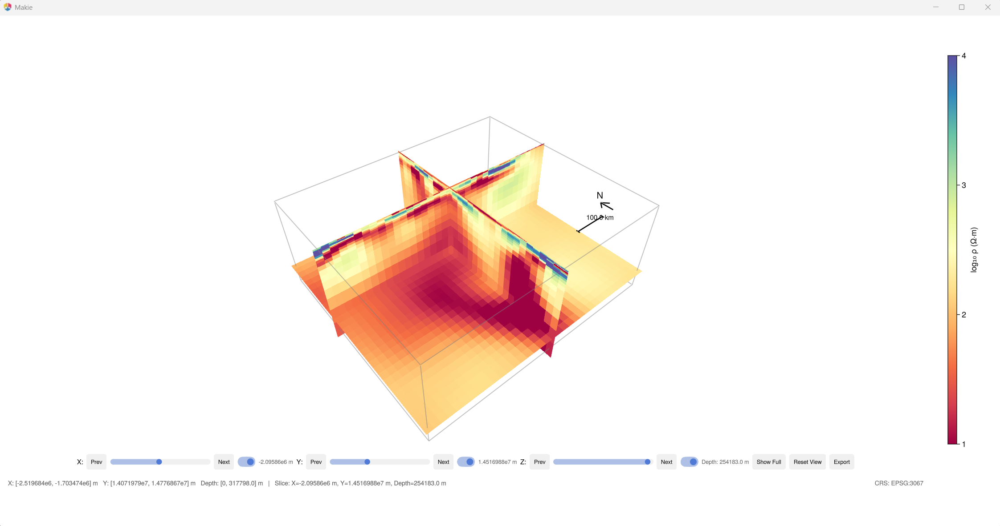

# Summary

MTGeophysics.jl is a Julia package for magnetotelluric (MT) geophysical
modelling, inversion, and interactive visualization. The magnetotelluric
method uses natural electromagnetic signals to image the electrical
resistivity structure of the Earth's subsurface, with applications
ranging from mineral exploration to studies of tectonic structure.
MTGeophysics.jl provides 1D and 2D forward solvers, stochastic
inversion based on Very Fast Simulated Annealing (VFSA)
[@SenStoffa2013] in 2D and 3D, I/O routines for the widely used
ModEM 3D inversion code [@Kelbert2014], and interactive 3D model
viewers built on GLMakie. Because many different subsurface
configurations can explain observed MT responses, the VFSA workflow
generates an ensemble of plausible models rather than a single
deterministic solution, enabling quantitative uncertainty assessment.
The package is designed to be accessible to researchers who need an
integrated, scriptable environment for MT data processing and
interpretation within the Julia ecosystem.

# Statement of need

Magnetotelluric surveys produce large volumes of multi-frequency,
multi-station electromagnetic data that must be processed through
forward modelling and inversion to obtain subsurface resistivity images.
Existing MT software is predominantly written in Fortran, MATLAB, or
Python: ModEM [@Egbert2012; @Kelbert2014] is a widely used 3D
inversion code written in Fortran; MARE2DEM [@Key2016] handles 2D/3D
marine electromagnetic modelling in Fortran; MTpy [@Kirkby2019] is a
Python toolbox for MT data processing and visualization; and numerous
MATLAB toolboxes exist for 1D and 2D analysis. However, these tools
are often disconnected, with separate programs for forward modelling,
inversion, file conversion, and visualization, requiring researchers to
maintain ad-hoc scripts in multiple languages to bridge them.

MTGeophysics.jl addresses this fragmentation by providing a single Julia
package that spans the entire MT workflow, from data collection and
quality control, through forward modelling and inversion, to a final
preferred subsurface model with quantified uncertainty. The longer-term
vision is to supply all the tools a researcher needs to carry out
magnetotelluric studies end-to-end, and to serve as a foundation on
which new methods can be built. Because Julia's type system and
multiple dispatch make it straightforward to compose packages,
MTGeophysics.jl is designed as a core component of a broader
JuliaGeophysics ecosystem. Its forward solvers and standardised data
structures are intended to support training of neural operators and
neural surrogates that learn to approximate the MT forward map,
enabling scientific machine learning workflows such as physics-informed
neural networks and operator learning for rapid approximate inversion.
Julia's composability with automatic differentiation and scientific
machine learning libraries makes MTGeophysics.jl a natural building
block for bridging classical geophysical inversion with modern
data-driven approaches.

The package targets MT researchers and students who want a unified,
open-source toolkit that leverages Julia's [@Bezanson2017] strengths in
numerical computing, automatic differentiation, composability, and
interactive graphics. It reads and writes standard ModEM file formats, enabling
direct interoperability with the Fortran ModEM code used by many
research groups worldwide.

# State of the field

Several open-source tools address parts of the MT workflow.
ModEM [@Egbert2012; @Kelbert2014] is the community standard for 3D MT
inversion but provides no built-in visualization or 1D/2D forward
capabilities. MARE2DEM [@Key2016] focuses on 2D and 3D marine
electromagnetic forward and inverse modelling but is Fortran-based and
limited to controlled-source methods. MTpy [@Kirkby2019] provides
comprehensive Python utilities for MT data handling, processing, and
visualization but does not include forward solvers or stochastic
inversion. pyGIMLi [@Ruecker2017] and SimPEG [@Cockett2015] are Python
frameworks for general geophysical inversion that include MT modules,
but their MT-specific functionality is embedded within much larger
codebases. None of these packages offer integrated stochastic inversion
with ensemble uncertainty quantification in both 2D and 3D.

MTGeophysics.jl contributes a tightly integrated Julia-native package
that covers 1D and 2D MT forward modelling, 2D and 3D VFSA
inversion with ensemble uncertainty quantification, and interactive 3D
model viewing with GIS overlay support. This combination is not
available in any single existing package. The choice of Julia provides
performance comparable to compiled languages while maintaining the
interactivity and rapid prototyping advantages of interpreted
environments.

# Software design

MTGeophysics.jl is structured as a single Julia module with clearly
separated functional layers. The core layer handles ModEM 3D data and
model I/O, supporting the standard ModEM file formats for models
(WinGLink/WS format) and impedance data. The 1D module implements both
analytical recursive impedance solutions and finite-difference solvers
on geometrically graded meshes. The 2D module constructs tensor meshes,
assembles sparse finite-difference operators for the TE and TM mode
Maxwell equations, and solves them using direct sparse factorization via
LinearSolve.jl.

The VFSA inversion module [@SenStoffa2013] uses radial basis function
(RBF) parameterization to map a reduced set of control points to the
full model grid, enabling efficient stochastic search in a
lower-dimensional space. In 2D the package includes its own
finite-difference forward engine; in 3D the inversion wraps the ModEM
forward solver [@Kelbert2014], ensuring compatibility with established
workflows. Multiple independent Markov chains run in parallel, and
ensemble statistics (mean, median, standard deviation) are computed
across chains to provide uncertainty estimates. Instead of producing a
single deterministic model, the workflow generates a set of plausible
models that explain the data comparably well, allowing geologists to
interpret results while being explicitly aware of the inherent
non-uniqueness.

Interactive visualization is handled through GLMakie, providing
GPU-accelerated 3D slice viewers (XY, XZ, YZ, and combined) with
slider controls, coordinate reprojection via Proj.jl, and optional
shapefile overlays for geological maps, faults, and survey boundaries.
The package also supports exporting depth slices and cross-sections as
georeferenced shapefiles suitable for integration into GIS platforms,
closing the loop between geophysical modelling and geological mapping.
The visualization layer is conditionally loaded, ensuring the core
package functions without OpenGL dependencies.

{#fig:slicer}

Publication-quality static plots use CairoMakie for data maps, response
curves, model cross-sections, and convergence diagnostics. All file
formats use plain text, ensuring reproducibility and version-control
friendliness.

# Research impact statement

MTGeophysics.jl has been developed to support ongoing magnetotelluric
research at the Geological Survey of Finland (GTK). The 2D VFSA
inversion module has been validated against the COMMEMI benchmarks
[@Zhdanov1997], reproducing known synthetic models. The 3D VFSA
inversion has been demonstrated at regional scale using USArray MT data
from the Cascadia subduction zone [@Patro2008], a dataset extensively
studied with deterministic 3D inversion, providing a direct benchmark
for the stochastic results. The package's ModEM I/O and 3D
visualization capabilities are actively used for interpreting
crustal-scale MT surveys in Finland. The repository includes complete
reproducible examples with synthetic datasets, benchmark scripts, and
documentation, making it ready for adoption by the broader MT research
community.

# AI usage disclosure

GitHub Copilot was used as a coding assistant during development of this
software and in drafting this paper. All AI-generated code and text were
reviewed, tested, and verified by the author for correctness.

# Acknowledgements

The author thanks the Geological Survey of Finland (GTK) for supporting
this work. The COMMEMI benchmark models used for validation were defined
by @Zhdanov1997.

# References
